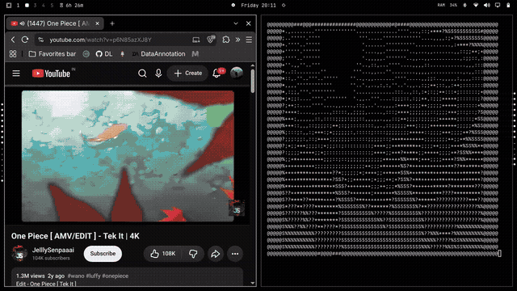

# ytascii

Watch YouTube videos directly in your terminal using real-time ASCII rendering.

ytascii is a lightweight Python CLI that extracts YouTube video and audio streams using yt-dlp, processes video frames with FFmpeg, converts them into grayscale ASCII characters, and renders them directly in the terminal.

## Demo

## Features

- Play YouTube videos as ASCII art
- Real-time frame rendering
- Automatic video stream selection
- Automatic audio stream selection
- Automatic FPS detection
- Automatic terminal-size adaptation
- Grayscale ASCII rendering
- Audio playback through ffplay
- No Python third-party packages required
- Supports different YouTube URLs and video formats

## How It Works

YouTube URL
     |
     v
   yt-dlp
     |
     +------------------+
     |                  |
     v                  v
Video stream       Audio stream
     |                  |
     v                  v
   FFmpeg             ffplay
     |
     v
Resize + Grayscale
     |
     v
Raw video frames
     |
     v
Python ASCII renderer
     |
     v
  Terminal

Each grayscale pixel is mapped to an ASCII character based on its brightness.

@ # S % ? * + ; : , . ' [space]

Dark pixels use denser characters, while brighter pixels use lighter characters.

## Requirements

- Python 3
- yt-dlp
- FFmpeg
- ffplay

### Arch Linux / Omarchy

Install the required dependencies:

sudo pacman -S python yt-dlp ffmpeg

Verify the installation:

python3 --version
yt-dlp --version
ffmpeg -version
ffplay -version

## Installation

Clone the repository:

git clone https://github.com/christeeno/ytascii.git
cd ytascii

Make the installer executable:

chmod +x install.sh

Run the installer:

./install.sh

The installer installs the ytascii command into:

~/.local/bin/ytascii

Make sure ~/.local/bin is included in your PATH.

Check the installation:

which ytascii
ytascii --help

## Usage

Run:

ytascii "YOUTUBE_URL"

Example:

ytascii "https://youtu.be/PDJLvF1dUek"

You can also use a standard YouTube URL:

ytascii "https://www.youtube.com/watch?v=tlJMx8H9Jd8"

Press Ctrl+C to stop playback.

## Terminal Size

ytascii automatically reads your terminal dimensions and adjusts the ASCII rendering size.

For the best experience, use a reasonably large terminal window.

## Project Structure

ytascii/
├── assets/
│   └── demo.gif
├── .gitignore
├── LICENSE
├── README.md
├── install.sh
└── ytascii.py

## Dependencies

ytascii itself uses only Python's standard library.

External tools used by the project:

### yt-dlp

Used to extract video and audio streams from YouTube.

### FFmpeg

Used to process the video stream, resize frames, convert frames to grayscale, and output raw video data.

### ffplay

Used to play the extracted audio stream.

## Technical Details

The player:

1. Retrieves YouTube video metadata using yt-dlp.
2. Selects a compatible video stream automatically.
3. Selects an appropriate audio stream automatically.
4. Reads the video's actual FPS.
5. Uses FFmpeg to resize the video.
6. Converts each frame to grayscale.
7. Converts grayscale pixel values into ASCII characters.
8. Renders the frames directly in the terminal.
9. Plays the audio independently using ffplay.
10. Maintains playback timing based on the video's FPS.

## Limitations

- ASCII quality depends on terminal size.
- Video playback can be CPU-intensive at higher terminal resolutions.
- YouTube stream formats and availability can change.
- Some videos may have restricted or unavailable streams.
- The project is primarily intended as a terminal-based CLI experiment.

## License

This project is licensed under the MIT License.

See the LICENSE file for details.

## Author

Christeeno Telfin

GitHub: https://github.com/christeeno
